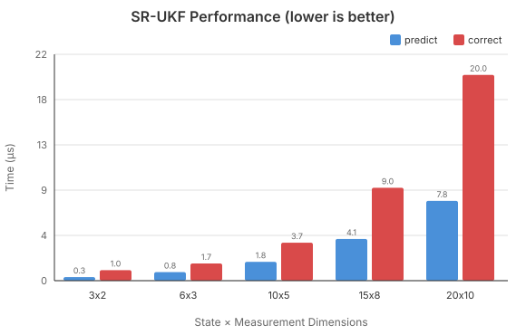
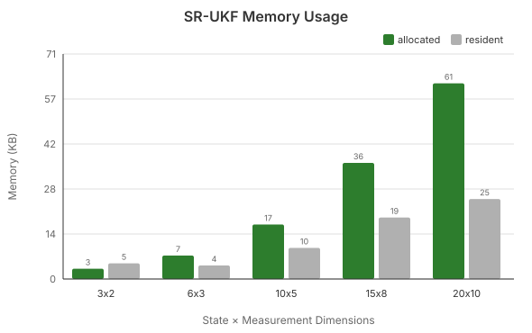
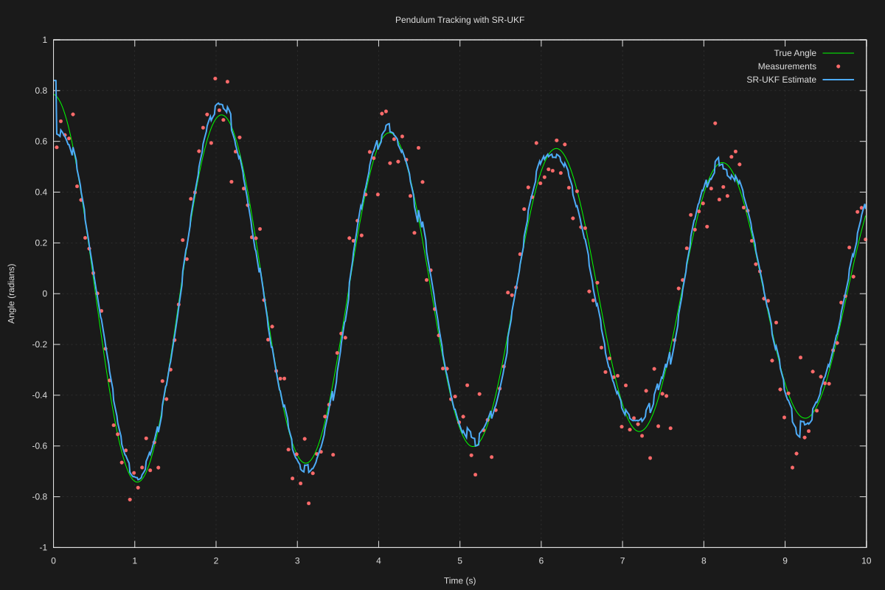
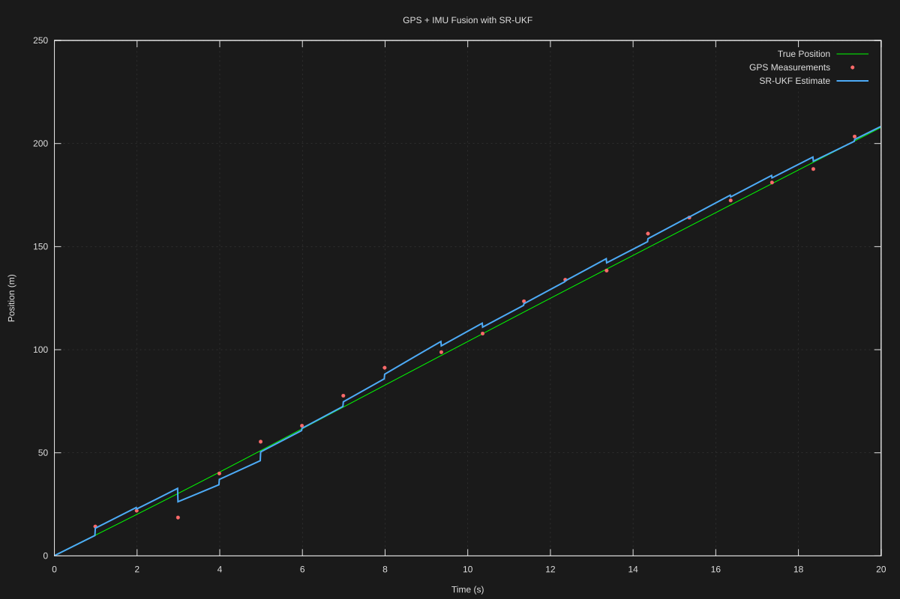
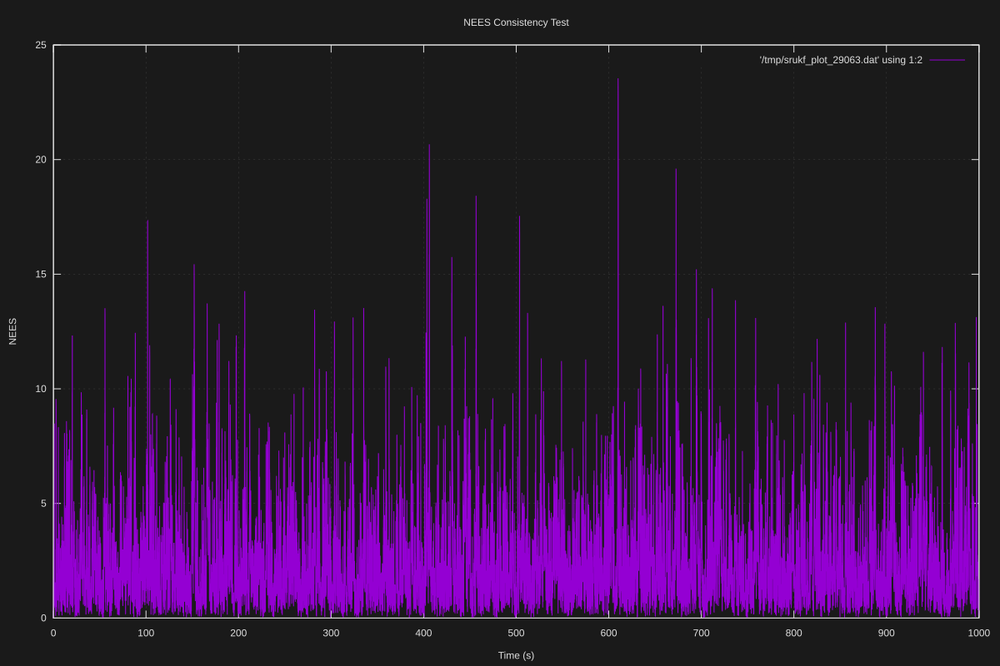

# srukf

[](https://github.com/disruptek/srukf/actions/workflows/ci.yml)
[](https://codecov.io/gh/disruptek/srukf)
[](https://pypi.org/project/srukf/)
[](LICENSE)
[](https://disruptek.github.io/srukf/)

C implementation of the Square-Root Unscented Kalman Filter.

## When to Use SR-UKF

**The scenario:** You're building a safety system for an electric unicycle.
The rider leans forward to accelerate, backward to brake, and side-to-side to
turn—constantly reorienting the onboard IMU through extreme angles. GPS
provides position fixes, but cuts out unpredictably under bridges, in urban
canyons, and near buildings. You need to fuse accelerometer, gyroscope, and
intermittent GPS into a reliable position and velocity estimate that runs
continuously for hours of riding.

**Why not a standard Kalman Filter?**
The classic Kalman filter assumes linear dynamics: `x_next = A*x + B*u`. But
transforming accelerometer readings from the wheel's wildly tilting reference
frame to earth coordinates requires rotation matrices full of sines and
cosines. A linear approximation falls apart when the rider leans 45° into a
hard turn.

**Why not an Extended Kalman Filter (EKF)?**
The EKF linearizes via Jacobians, which you must derive analytically for your
specific model. For 3D rotations with quaternions or Euler angles, this is
tedious and error-prone. Worse, when the rider's pose changes rapidly—hopping
off a curb, dodging a pedestrian—the linearization becomes a poor
approximation of reality, and the filter can diverge.

**Why not a standard Unscented Kalman Filter (UKF)?**
The UKF handles nonlinearity elegantly via sigma points—no Jacobians needed.
But it maintains the full covariance matrix P, and here's the problem: when
GPS cuts out, the filter runs on IMU alone and uncertainty grows. When GPS
returns, the correction step subtracts a large outer product from P. Over
thousands of these cycles, numerical roundoff accumulates. Eventually P loses
positive-definiteness, and the filter crashes—possibly mid-ride.

**Why SR-UKF?**
The Square-Root UKF maintains S where P = SSᵀ. This has two key benefits:

1. **Guaranteed stability**: We never explicitly subtract matrices. Instead,
   covariance updates use QR decomposition (for the predict step) and
   Cholesky rank-1 downdates (for corrections). These operations preserve
   the triangular structure of S by construction.

2. **Double the precision**: Errors in S translate to *squared* errors in P.
   If S has 15 digits of precision, P effectively has 30. This matters when
   uncertainty swings wildly between GPS-available and GPS-denied conditions.

**Real-world impact:** A standard UKF running at 100Hz might fail after a few
hours due to accumulated roundoff during repeated GPS dropout/reacquisition
cycles. The SR-UKF handles this indefinitely. For a safety-critical system
on a vehicle that could hit 30 mph, "might crash after a few hours" isn't
acceptable.

## Overview

State estimation library for nonlinear dynamic systems. Provides predict and
correct operations for sensor fusion applications.

## Performance



Typical performance on modern hardware (times in microseconds per operation).
The `correct` step is more expensive than `predict` because it involves
computing the Kalman gain and performing multiple Cholesky downdates.



Memory usage scales with state and measurement dimensions. Green bars show
total allocated bytes (filter + workspace); gray bars show actual RSS, which
is often lower due to Linux lazy allocation (pages aren't mapped until touched).
The allocated value is authoritative for capacity planning.

Workspace memory can be pre-allocated via `srukf_alloc_workspace()` to avoid
malloc during filtering, or left to allocate on first use. Pre-allocation is
recommended for real-time systems; lazy allocation suits memory-constrained
environments where filters may not all be used.

Run `make bench` / `make bench-memory` to benchmark on your system, or
`make bench-chart` / `make bench-memory-chart` to regenerate the charts.

## Requirements

- C99 compiler (GCC or Clang)
- OpenBLAS
- LAPACKE

On Debian/Ubuntu:

    apt install libopenblas-dev liblapacke-dev

## Building

    make        # build library and run tests
    make lib    # build libsrukf.so only
    make test   # run tests
    make bench  # run benchmarks
    make docs   # generate API documentation (requires Doxygen)

## Installation

    make install                  # installs to /usr/local
    make install PREFIX=/opt/sr  # installs to /opt/sr

### Build Options

- `SRUKF_SINGLE` - Compile with single-precision floats instead of doubles:

        CFLAGS=-DSRUKF_SINGLE make lib

## Examples

**Learn by doing!** The `examples/` directory contains four comprehensive examples with visualizations and detailed documentation:

### 🎯 **Interactive Web Explainer** - Start Here!

Open in your browser (no compilation needed):
```bash
cd examples/web_explainer
firefox index.html
```

**Features:**
- Drag and interact with sigma points
- Watch uncertainty transform through sin(x), x², exp(x)
- Animate the predict-measure-update cycle
- Mathematical foundations explained visually

Perfect for understanding UKF concepts before diving into code.

[→ View the explainer](examples/web_explainer/)

---

### 🎪 **1. Pendulum Tracking** - Your First Example

Track a nonlinear pendulum with noisy angle measurements:

```bash
cd examples/01_pendulum
make
./pendulum --open
```

**What you'll learn:**
- Setting up a UKF for a nonlinear system
- Handling sin(θ) dynamics with RK4 integration
- Tuning process and measurement noise
- Generating professional visualizations

**Difficulty:** Beginner | **Time:** 20 minutes



[→ Pendulum example](examples/01_pendulum/)

---

### 🛰️ **2. GPS + IMU Sensor Fusion**

Fuse intermittent GPS with continuous IMU in 1D motion:

```bash
cd examples/02_gps_imu_1d
make
./gps_imu --open
```

**What you'll learn:**
- Multi-sensor fusion (GPS 1 Hz + IMU 100 Hz)
- Handling measurement dropouts gracefully
- Watching uncertainty grow and shrink
- Real-world autonomous navigation patterns

**Difficulty:** Intermediate | **Time:** 30 minutes



[→ GPS+IMU example](examples/02_gps_imu_1d/)

---

### 🔬 **3. Long-Duration Stability Test**

Stress-test SR-UKF's numerical robustness:

```bash
cd examples/03_stability_test
make
./stability --scenario=baseline --verbose
```

**What you'll learn:**
- Why square-root formulation matters
- Monitoring filter health (NEES, condition numbers)
- Four challenging test scenarios
- Performance characteristics (1M+ steps/second)

**Difficulty:** Intermediate | **Time:** 45 minutes



[→ Stability test example](examples/03_stability_test/)

---

**All examples include:**
- ✅ Heavily documented source code
- ✅ Pre-generated visualizations (SVG)
- ✅ Multiple output formats (SVG, CSV, JSON)
- ✅ Detailed READMEs with physics explanations
- ✅ Build instructions and troubleshooting

**Total learning time:** ~2 hours to master all examples

[→ See all examples](examples/)

---

## Usage

### Basic Example

```c
#include "srukf.h"

// Create filter: 3 states, 2 measurements
srukf *ukf = srukf_create(3, 2);

// Set noise covariances (as square-roots)
srukf_set_noise(ukf, Qsqrt, Rsqrt);

// Predict with process model f(x) -> x'
srukf_predict(ukf, process_model, NULL);

// Correct with measurement z and model h(x) -> z
srukf_correct(ukf, z, measurement_model, NULL);

// Read the state estimate
srukf_mat *x = srukf_mat_alloc(3, 1, 1);
srukf_get_state(ukf, x);
srukf_value x0 = SRUKF_ENTRY(x, 0, 0);

srukf_mat_free(x);
srukf_free(ukf);
```

The `srukf` structure is opaque; all state access goes through accessor
functions, which keeps the ABI stable for bindings and dynamically
linked consumers.

### State and Covariance Access

```c
// Get current state estimate
srukf_mat *x_out = srukf_mat_alloc(N, 1, 1);
srukf_get_state(ukf, x_out);

// Get current sqrt-covariance
srukf_mat *S_out = srukf_mat_alloc(N, N, 1);
srukf_get_sqrt_cov(ukf, S_out);

// Set state and covariance
srukf_set_state(ukf, x_init);
srukf_set_sqrt_cov(ukf, S_init);

// Reset to initial conditions
srukf_reset(ukf, 1.0);  // init_std = 1.0

srukf_mat_free(x_out);
srukf_mat_free(S_out);
```

### Innovation Monitoring and Gating

After each successful correct step, the innovation, its
sqrt-covariance, and the normalized innovation squared (NIS) are
available for filter-health monitoring and measurement gating:

```c
srukf_correct(ukf, z, h, NULL);

srukf_value nis;
srukf_get_nis(ukf, &nis);  // chi-square with M degrees of freedom
```

To gate a measurement *before* accepting it, run `srukf_correct_to()`
on scratch buffers and inspect the NIS; commit with `srukf_set_state()`
/ `srukf_set_sqrt_cov()` only if it passes.

### Angles and Other Non-Euclidean States

States or measurements containing angles break Euclidean averaging at
the ±π wrap. Register mean/residual hooks to fix the statistics:

```c
srukf_set_state_ops(ukf, angle_mean, angle_residual, NULL);
srukf_set_meas_ops(ukf, angle_mean, angle_residual, NULL);
```

See `tests/50_hooks.c` for a complete angle-tracking example with
circular mean and wrapped residual implementations.

### Tuning UKF Parameters

The UKF spread is controlled by three parameters:

```c
// Set UKF scaling parameters
srukf_set_scale(ukf,
                1e-3,  // alpha: spread (typically 1e-3)
                2.0,   // beta: prior knowledge (2.0 for Gaussian)
                0.0);  // kappa: secondary scaling
```

- `alpha` controls the spread of sigma points (typically 1e-3 to 1)
- `beta` incorporates prior knowledge of the distribution (2.0 is optimal for Gaussian)
- `kappa` provides secondary scaling (typically 0 or 3 - N)

### Transactional Operations

For advanced use cases like ensemble filtering or multi-hypothesis tracking:

```c
// Perform predict on a copy without modifying filter state
srukf_mat *x_candidate = srukf_mat_alloc(N, 1, 1);
srukf_mat *S_candidate = srukf_mat_alloc(N, N, 1);

srukf_get_state(ukf, x_candidate);
srukf_get_sqrt_cov(ukf, S_candidate);

srukf_predict_to(ukf, x_candidate, S_candidate, process_model, NULL);
// Filter's internal state is unchanged

srukf_mat_free(x_candidate);
srukf_mat_free(S_candidate);
```

### Error Handling

Functions return `srukf_return` codes:

```c
srukf_return status = srukf_predict(ukf, model, NULL);

if (status == SRUKF_RETURN_OK) {
  // success
} else if (status == SRUKF_RETURN_PARAMETER_ERROR) {
  // invalid parameters
} else if (status == SRUKF_RETURN_MATH_ERROR) {
  // numerical/mathematical error
} else if (status == SRUKF_RETURN_MEMORY_ERROR) {
  // allocation failure
}
```

On any error from `srukf_predict()`/`srukf_correct()`, the filter state
is unchanged — a failed step never commits partial results.

### Workspace Management

For performance-critical applications, pre-allocate workspace to avoid allocations during filtering:

```c
// Pre-allocate internal workspace
srukf_alloc_workspace(ukf);

// Now predict/correct use pre-allocated memory
srukf_predict(ukf, model, NULL);
srukf_correct(ukf, z, h, NULL);

// Free workspace when done
srukf_free_workspace(ukf);
```

## API Overview

The complete, always-current reference lives in `srukf.h` (every
function is documented there) and at
**https://disruptek.github.io/srukf/**. The API groups:

| Group | Functions |
|-------|-----------|
| Lifecycle | `srukf_create`, `srukf_create_from_noise`, `srukf_free` |
| Configuration | `srukf_set_noise`, `srukf_set_scale`, `srukf_get_scale` |
| State access | `srukf_get_state`/`srukf_set_state`, `srukf_get_sqrt_cov`/`srukf_set_sqrt_cov`, `srukf_reset`, `srukf_state_dim`, `srukf_meas_dim` |
| Core operations | `srukf_predict`, `srukf_correct` |
| Transactional | `srukf_predict_to`, `srukf_correct_to` (operate on user buffers) |
| Innovation | `srukf_get_innovation`, `srukf_get_innovation_sqrt_cov`, `srukf_get_nis` |
| Custom spaces | `srukf_set_state_ops`, `srukf_set_meas_ops` (angle/quaternion support) |
| Workspace | `srukf_alloc_workspace`, `srukf_free_workspace` |
| Diagnostics | `srukf_set_diag` (per-instance), `srukf_set_diag_callback` (global) |
| Matrices | `srukf_mat_alloc`, `srukf_mat_free`, `SRUKF_ENTRY`, `SRUKF_MAT_ALLOC` |
| Version | `srukf_version`, `SRUKF_VERSION` |

All fallible functions return `srukf_return`: `SRUKF_RETURN_OK`,
`SRUKF_RETURN_PARAMETER_ERROR`, `SRUKF_RETURN_MATH_ERROR`, or
`SRUKF_RETURN_MEMORY_ERROR`.

## Limitations

- **One thread per filter instance.** Distinct instances may run on
  different threads concurrently; give each a per-instance diagnostic
  handler via `srukf_set_diag()`. The optional global callback
  (`srukf_set_diag_callback()`) is shared and only safe when set once
  before threads start.
- **Noise matrices must be square-roots**. Provide S where P = S*S', not P directly.
- **Column-major layout**. All matrices must be in column-major (Fortran) order.

## Documentation

Full API documentation with algorithm explanations is available at:
**https://disruptek.github.io/srukf/**

The docs include:
- Intuitive explanations of the Unscented Transform and sigma points
- Why square-root formulation provides numerical stability
- Detailed algorithm walkthroughs for predict and correct steps
- Tuning parameter guide (α, β, κ)
- Complete API reference with examples

**Also check out:**
- **[Interactive Examples](https://disruptek.github.io/srukf/examples/)** - Web explainer + 3 runnable C examples
- **[Example Source Code](examples/)** - Four complete examples with visualizations

Generate locally with `make docs` (requires [Doxygen](https://www.doxygen.nl/)).

## Acknowledgments

Matrix utilities derived from [LAH](https://github.com/maj0e/linear-algebra-helpers) by maj0e (MIT License).

## License

MIT License. See LICENSE file.
