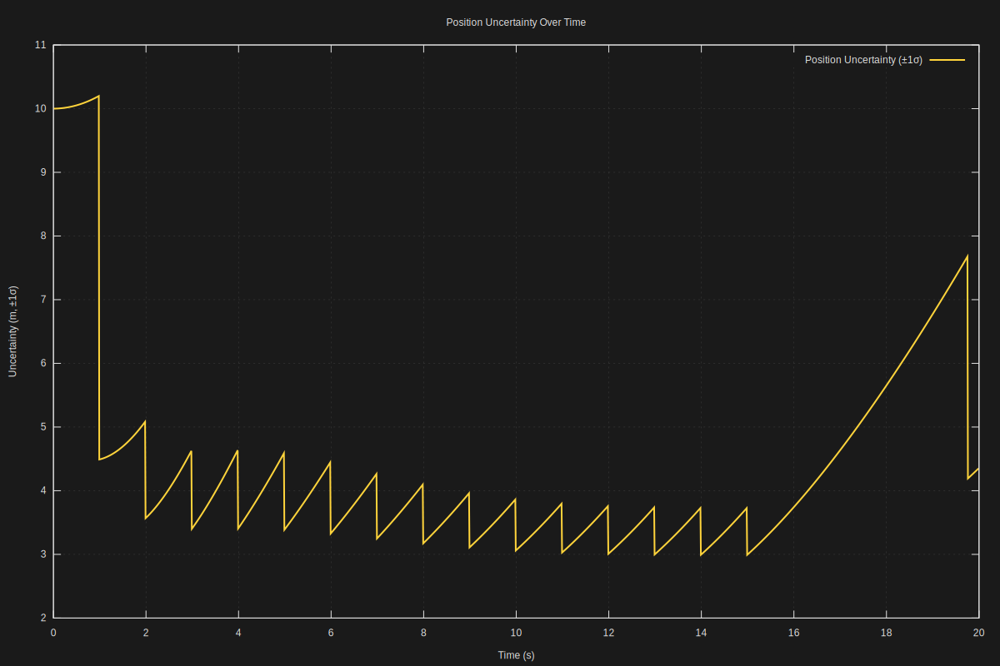
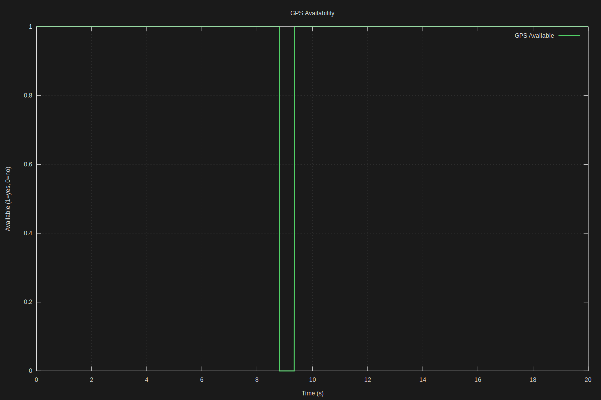

# GPS+IMU Sensor Fusion with SR-UKF

This example demonstrates multi-sensor fusion using the Square-Root Unscented Kalman Filter to track 1D motion by combining GPS position measurements with IMU acceleration data.

## What This Example Shows

1. **Multi-Sensor Fusion**: Combines two different sensor types (GPS and IMU) with different characteristics
2. **Intermittent Measurements**: Handles GPS dropouts gracefully - a common real-world scenario
3. **Uncertainty Growth**: Watch uncertainty increase during GPS outages and decrease when GPS returns
4. **3D State Space**: Estimates position, velocity, and acceleration simultaneously
5. **Different Measurement Rates**: GPS slower (1 Hz) than IMU (10 Hz), handled naturally by the filter

## The Scenario

A vehicle moves in 1D with constant acceleration (like a car speeding up):

```
True motion: x(t) = 0.5 * a * t²
Where: a = 2.0 m/s² (constant acceleration)
```

**Sensors:**
- **GPS**: Measures position directly, 1 Hz, slow but accurate (σ = 5.0 m)
- **IMU**: Measures acceleration, 10 Hz, fast but noisy (σ = 0.5 m/s²)

**Challenge:** GPS drops out for 5 seconds (t=10 to t=15), simulating tunnel/urban canyon scenarios.

## Why This Matters

This is a simplified version of real autonomous vehicle navigation:

1. **GPS alone**: Good position but no velocity, fails in tunnels/urban canyons
2. **IMU alone**: Drifts rapidly due to double integration of noisy acceleration
3. **GPS+IMU fusion**: Best of both - continuous smooth estimates that bridge GPS gaps

## Building and Running

### Prerequisites

- SR-UKF library built (`make lib` in the root directory)
- (Optional) gnuplot for SVG generation: `apt install gnuplot`

### Build

```bash
make
```

### Run

Default run (20 seconds, GPS dropout at t=10-15s):
```bash
./gps_imu
```

Longer simulation:
```bash
./gps_imu --duration=30
```

Adjust GPS dropout window:
```bash
./gps_imu --dropout-start=5 --dropout-end=10
```

Adjust noise levels:
```bash
./gps_imu --gps-noise=10.0 --imu-noise=1.0
```

Generate all output formats:
```bash
./gps_imu --format=all
```

### Command-Line Options

- `--duration=SECONDS` - Simulation duration (default: 20.0)
- `--dropout-start=TIME` - GPS dropout start time in seconds (default: 10.0)
- `--dropout-end=TIME` - GPS dropout end time in seconds (default: 15.0)
- `--gps-noise=SIGMA` - GPS measurement noise std dev in meters (default: 5.0)
- `--imu-noise=SIGMA` - IMU measurement noise std dev in m/s² (default: 0.5)
- `--format=FORMAT` - Output format: `svg`, `csv`, `json`, or `all` (default: `svg`)
- `--open` - Automatically open SVGs after generation
- `--help` - Show usage information

## Output Files

### SVG Plots (requires gnuplot)

Three visualization files are generated:

**1. `gps_imu_position.svg`** - Position tracking over time:
- True position (green line)
- GPS measurements (red points, with gap during dropout)
- IMU-only estimates (orange dashed, when available)
- SR-UKF fused estimate (blue line)


**2. `gps_imu_uncertainty.svg`** - Estimation uncertainty (standard deviation):
- Position uncertainty (blue line)
- Velocity uncertainty (orange line)
- Acceleration uncertainty (green line)
- GPS dropout period (shaded region)



**3. `gps_imu_availability.svg`** - Sensor availability timeline:
- GPS availability (binary: 1=available, 0=dropout)
- IMU availability (always 1 in this example)



### CSV

Multiple CSV files are generated with tab-delimited columns:

- `gps_imu_truth.csv` - Ground truth state at every timestep
- `gps_imu_gps.csv` - GPS measurements (only at 1 Hz, with gaps)
- `gps_imu_imu.csv` - IMU measurements (at 10 Hz)
- `gps_imu_estimate.csv` - SR-UKF state estimates
- `gps_imu_uncertainty.csv` - Uncertainty (standard deviations)

Timestamps use ISO8601-style format (elapsed seconds with high precision).

### JSON

`gps_imu.json` - Structured data format with all time series for web visualization or analysis.

## What to Observe

### In the Position Plot

1. **Before dropout (t < 10s)**: 
   - GPS measurements (red) are noisy but centered on truth
   - SR-UKF estimate (blue) is smooth and tracks truth closely
   
2. **During dropout (t = 10-15s)**:
   - No red GPS points visible
   - SR-UKF estimate continues smoothly using IMU + physics model
   - Estimate may drift slightly due to accumulated IMU errors
   
3. **After dropout (t > 15s)**:
   - GPS measurements return
   - SR-UKF quickly corrects any drift and locks back onto truth

### In the Uncertainty Plot

This is the most educational plot:

1. **GPS available**: Uncertainty stays low and stable
2. **GPS dropout begins**: Uncertainty starts growing (filter knows it's "flying blind")
3. **During dropout**: Exponential uncertainty growth as IMU errors accumulate
4. **GPS returns**: Sharp drop in uncertainty as GPS "anchors" the estimate again

**Key insight:** The filter is self-aware! It quantifies its own ignorance.

### In the Code

The heavily commented source code (`gps_imu.c`) explains:

- **Process Model**: How we model kinematic motion (position, velocity, acceleration)
- **Dual Measurement Models**: GPS measures position; IMU measures acceleration
- **Selective Updates**: How the filter handles intermittent GPS measurements
- **Covariance Growth**: Why uncertainty increases without GPS
- **Noise Tuning**: Balancing trust between model prediction and sensor measurements

## Educational Value

This example teaches:

1. **Sensor Complementarity**: Different sensors have different strengths
2. **Measurement Availability**: Real systems must handle sensor failures
3. **Uncertainty Quantification**: Not just estimates, but confidence in estimates
4. **State Augmentation**: Estimating unmeasured states (velocity) from measured ones
5. **Multi-Rate Fusion**: Fast and slow sensors working together

## Real-World Applications

This simplified 1D example mirrors real systems:

- **Autonomous vehicles**: GPS + IMU + wheel odometry
- **Drones**: GPS + IMU + barometer + visual odometry
- **Smartphones**: GPS + IMU for pedestrian navigation
- **Spacecraft**: Star tracker + gyroscopes + accelerometers

## Extending This Example

Try modifying:

- **Non-constant acceleration**: Add time-varying acceleration profiles
- **IMU drift**: Model realistic IMU bias drift over time
- **Longer dropouts**: Increase dropout duration to see divergence
- **2D/3D motion**: Extend to planar or 3D motion
- **Additional sensors**: Add wheel odometry or visual measurements
- **Outlier rejection**: Detect and reject bad GPS measurements

## Troubleshooting

### "gnuplot not found"

SVG generation requires gnuplot. Install it:
```bash
sudo apt install gnuplot  # Debian/Ubuntu
```

Or use CSV/JSON output and plot with your preferred tool.

Pre-generated SVGs are included in the repository for reference.

### Build errors

Make sure the SR-UKF library is built first:
```bash
cd ../..
make lib
cd examples/02_gps_imu_1d
make
```

### Divergence during dropout

If the estimate diverges significantly during GPS dropout:

1. **Check IMU noise**: If `imu_noise` is too low, the filter overtrusts noisy IMU data
2. **Check process noise**: If process noise (Q) is too low, the filter is overconfident in its model
3. **Check initial conditions**: Make sure initial state and covariance are reasonable

### Filter ignores GPS

If the estimate doesn't track GPS well:

1. **Check GPS noise**: If `gps_noise` is too high, the filter ignores GPS measurements
2. **Check initial covariance**: If P₀ is too small, the filter is overconfident and resists corrections

## Comparison with Pendulum Example

| Aspect | Pendulum | GPS+IMU |
|--------|----------|---------|
| **State dimension** | 2D (angle, velocity) | 3D (pos, vel, accel) |
| **Nonlinearity** | Strong (sin θ) | Weak (nearly linear) |
| **Sensors** | Single (angle) | Dual (GPS, IMU) |
| **Measurement rate** | Constant | Variable |
| **Dropout simulation** | No | Yes (GPS) |
| **Main lesson** | Nonlinear dynamics | Sensor fusion |

## Next Steps

After understanding this example, try:

1. **Stability Test** (`examples/03_stability_test`) - Long-duration numerical stability
2. **Web Explainer** (TBD) - Interactive visualization of UKF sigma points
3. Read the paper: Van der Merwe & Wan (2001) "The Square-Root Unscented Kalman Filter"

## References

- [Wikipedia: Kalman Filter](https://en.wikipedia.org/wiki/Kalman_filter)
- [Sensor Fusion for Navigation](https://en.wikipedia.org/wiki/Sensor_fusion)
- Main SR-UKF library: `../../srukf.h`
