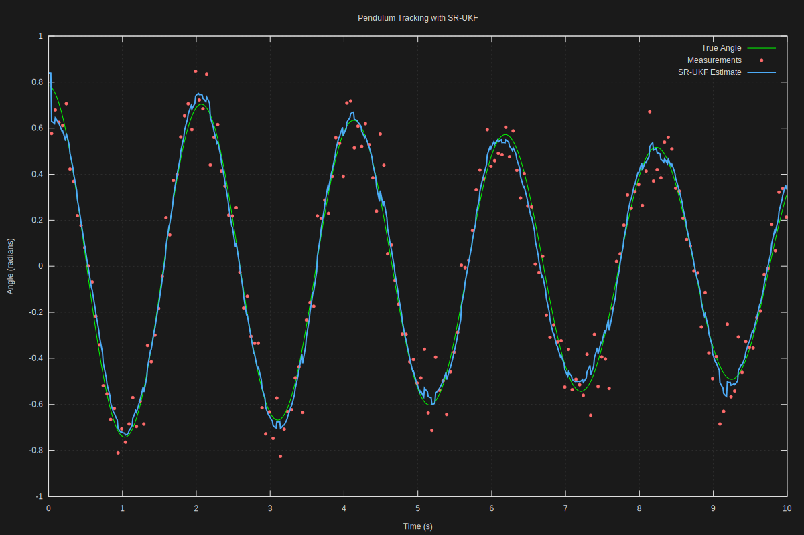
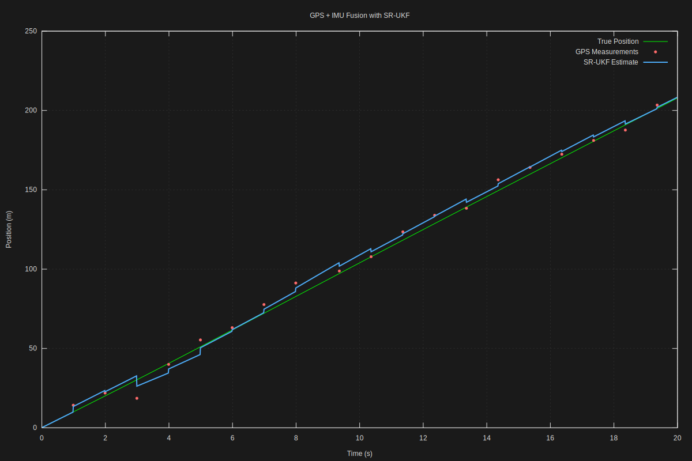
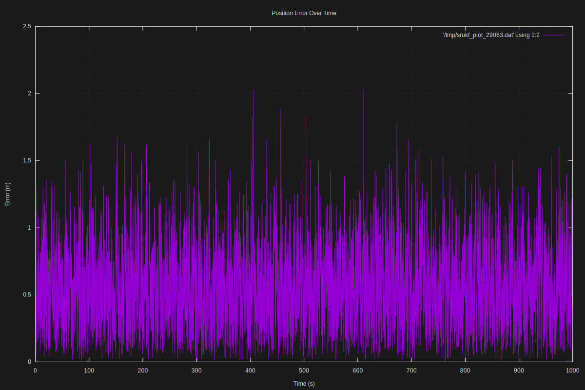

# SR-UKF Examples

This directory contains examples demonstrating the Square-Root Unscented Kalman Filter in action. Each example is self-contained with detailed documentation, build instructions, and pre-generated visualizations.

## Available Examples

### 1. **Pendulum Tracking** (`01_pendulum/`)

Track a nonlinear pendulum with noisy angle measurements.

**Difficulty**: Beginner  
**Concepts**: Nonlinear dynamics, state estimation, RK4 integration  
**Dimensions**: 2D state (angle, velocity), 1D measurement

**Why this example?**
- Easy to understand physically
- Clear nonlinearity (`sin(θ)` in dynamics)
- Beautiful phase-space visualization
- Perfect introduction to UKF concepts



[→ Run this example](01_pendulum/)

---

### 2. **GPS + IMU Fusion** (`02_gps_imu_1d/`)

Fuse continuous IMU measurements with intermittent GPS updates in 1D motion.

**Difficulty**: Intermediate  
**Concepts**: Sensor fusion, intermittent measurements, uncertainty growth  
**Dimensions**: 3D state (position, velocity, acceleration), 2 measurement types

**Why this example?**
- Real-world application (autonomous navigation)
- Shows uncertainty growing/shrinking during GPS dropouts
- Demonstrates handling measurement outages gracefully
- Multi-rate sensor fusion (GPS 1 Hz, IMU 100 Hz)
- Foundation for full 3D navigation systems

**Key Features:**
- GPS dropout simulation
- Three visualization plots (position, uncertainty, availability)
- Demonstrates filter "bridging" measurement gaps
- Shows complementary sensor characteristics



[→ Run this example](02_gps_imu_1d/)

---

### 3. **Long-Duration Stability** (`03_stability_test/`)

Demonstrate SR-UKF's numerical stability over extended operation (thousands of iterations).

**Difficulty**: Intermediate  
**Concepts**: Numerical stability, covariance conditioning, long-term filtering  
**Dimensions**: 4D state (2D position + velocity)

**Why this example?**
- Proves the core SR-UKF value proposition (stability)
- Shows robustness to numerical issues over time
- Educational for understanding square-root formulation benefits
- Four challenging test scenarios
- Performance metrics (1M+ steps/second)

**Test Scenarios:**
1. **Baseline** - Standard conditions (1000s duration)
2. **High Dynamics** - Aggressive maneuvering
3. **Poor Observability** - Infrequent measurements
4. **Extreme Noise** - Very noisy sensors

**Health Metrics:**
- Covariance trace, determinant, condition number
- NEES (Normalized Estimation Error Squared) consistency test
- NaN/Inf detection
- Positive definiteness verification



[→ Run this example](03_stability_test/)

---

### 4. **Interactive Web Explainer** (`web_explainer/`)

Browser-based interactive visualization of UKF concepts. No compilation needed!

**Difficulty**: Beginner (for viewing), Advanced (for understanding internals)  
**Concepts**: Sigma points, unscented transform, nonlinear transformations  
**Format**: HTML/CSS/JavaScript (runs in browser)

**Why this example?**
- Visual understanding of abstract concepts
- Interactive - drag and experiment!
- No build tools or dependencies required
- Perfect for teaching and presentations
- Shows sigma point magic in real-time

**Features:**
- **Sigma Points Visualization**: See how 3 points capture uncertainty through sin(x), x², exp(x)
- **Algorithm Animation**: Step through predict-measure-update cycle
- **Multiple Nonlinear Functions**: Compare different transformations
- **Live Statistics**: Input/output mean and variance
- **Mathematical Foundations**: Embedded equations and explanations

**Just open in browser:**
```bash
cd web_explainer
firefox index.html  # or chrome, safari, etc.
```

No server, no build process, no dependencies. Pure HTML5!

[→ Open the explainer](web_explainer/)

---

## Building Examples

### Prerequisites

1. **SR-UKF Library**: Build the main library first
   ```bash
   cd ..
   make lib
   ```

2. **Dependencies**: 
   - Standard build tools (gcc, make)
   - LAPACK/BLAS (liblapacke-dev, libopenblas-dev)
   - **Optional**: gnuplot for SVG generation

3. **Install gnuplot** (optional but recommended):
   ```bash
   sudo apt install gnuplot      # Debian/Ubuntu
   brew install gnuplot          # macOS
   ```

### Build All Examples

```bash
make examples        # From root directory
```

Or build individually:

```bash
cd examples/01_pendulum
make
./pendulum --help
```

## Output Formats

All examples support multiple output formats via `--format` flag:

### SVG (Default)

Professional-quality vector graphics generated via gnuplot:
- Dark mode enabled for better readability
- High resolution (1200x800)
- Embedded fonts and styling
- Can be opened directly or included in documentation

If gnuplot is unavailable, pre-generated SVGs are included in the repository.

### CSV

Comma-separated values for analysis in external tools:
- Multiple CSV files if different time axes exist
- ISO8601-style timestamps (elapsed seconds with microsecond precision)
- One file per unique time axis
- Easy to import into Python, R, MATLAB, Excel, etc.

Example:
```csv
timestamp,True Angle,Measurements,SR-UKF Estimate
0.000000,0.785398,NaN,0.792156
0.010000,0.784234,NaN,0.791023
0.020000,0.782897,0.821435,0.789654
...
```

### JSON

Structured data for web visualization:
- Simple schema: array of series, each with name and data points
- Suitable for D3.js, Chart.js, etc.
- Includes metadata in comments (can be extended)

Example:
```json
{
  "series": [
    {
      "name": "True Angle",
      "data": [
        {"t": 0.000000, "y": 0.785398},
        {"t": 0.010000, "y": 0.784234},
        ...
      ]
    },
    ...
  ]
}
```

## Common Utilities

The `common/` directory provides shared functionality:

- **`plot_utils.h/.c`**: Multi-format output, gnuplot integration
- **`example_helpers.h/.c`** *(TBD)*: Filter setup helpers, noise generation

These utilities handle the grunt work so example code can focus on the filtering problem.

## Design Philosophy

Each example follows these principles:

1. **Heavy Documentation**: Every function, every parameter explained
2. **Physical Intuition**: Real-world context, not just math
3. **Self-Contained**: Can be understood without reading other examples
4. **Pedagogical**: Designed for learning, not just demonstration
5. **Production-Quality Code**: Real comments, error handling, clean structure

## Running Examples

### Quick Start

```bash
cd examples/01_pendulum
make
./pendulum --open
```

### Common Options

Most examples support:
- `--duration=SECONDS` - How long to simulate
- `--noise=LEVEL` - Measurement noise standard deviation
- `--format=FORMAT` - Output format (svg, csv, json, all)
- `--open` - Auto-open SVG after generation
- `--help` - Show usage information

### Tips

1. **Start with default settings** to see expected behavior
2. **Increase noise** to stress-test the filter
3. **Generate all formats** (`--format=all`) for analysis
4. **Use `--open`** for immediate visual feedback

## Understanding the Output

### What to Look For

1. **Measurement Scatter**: Raw sensor data is noisy
2. **Smooth Estimates**: Filter output is smooth despite noise
3. **Tracking Accuracy**: Estimate follows true state closely
4. **Uncertainty**: Confidence bounds show filter's self-awareness
5. **Phase Behavior**: Small lag is normal and tunable

### Red Flags

- **Divergence**: Estimate drifts away from truth → tune noise parameters
- **Jerky Estimates**: Too much noise rejection → increase process noise
- **Ignoring Measurements**: Filter too conservative → decrease measurement noise

## Contributing New Examples

Wanted examples:
- 2D object tracking (bearing-only measurements)
- Attitude estimation (quaternions)
- Target tracking with clutter
- Battery state-of-charge estimation
- Any sensor fusion application!

See existing examples for structure and documentation style.

## Troubleshooting

### "srukf.h not found"

Build the library first:
```bash
cd ../..
make lib
```

### "gnuplot not found"

Install gnuplot or use `--format=csv`:
```bash
sudo apt install gnuplot
# OR
./pendulum --format=csv
```

### Example crashes or gives bad results

1. Check that library is up to date: `make clean && make lib` in root
2. Try default parameters first before customizing
3. Check noise parameters are reasonable for your problem scale
4. Look at CSV output to debug numeric issues

### Build errors with LAPACK

Make sure LAPACK/BLAS are installed:
```bash
sudo apt install libopenblas-dev liblapacke-dev
```

## Summary Table

| Example | Difficulty | State Dim | Key Concept | Build Required | Estimated Time |
|---------|------------|-----------|-------------|----------------|----------------|
| **Web Explainer** | Beginner | 1D | Sigma points visualization | No | 10 min |
| **Pendulum** | Beginner | 2D | Nonlinear dynamics | Yes | 20 min |
| **GPS+IMU** | Intermediate | 3D | Sensor fusion | Yes | 30 min |
| **Stability Test** | Intermediate | 4D | Numerical robustness | Yes | 45 min |

**Total learning time:** ~2 hours to work through all examples

## Next Steps

1. **Start with web explainer** - no compilation, instant gratification
2. **Build and run pendulum** - easiest C code example
3. **Read the source code** - it's heavily documented for learning
4. **Experiment with parameters** - break things and see what happens!
5. **Try GPS+IMU and stability** - advanced real-world scenarios
6. **Implement your own example** - best way to solidify understanding

## Learning Path

We recommend exploring the examples in this order:

1. **Web Explainer** (`web_explainer/`) - Start here to understand UKF concepts visually
   - No compilation needed
   - Interactive and intuitive
   - Builds mental model of sigma points

2. **Pendulum** (`01_pendulum/`) - First code example
   - Simple physics everyone understands
   - Clear nonlinearity (sin θ)
   - Learn filter setup and tuning

3. **GPS+IMU** (`02_gps_imu_1d/`) - Real-world application
   - Multi-sensor fusion
   - Handling measurement dropouts
   - Production-relevant patterns

4. **Stability Test** (`03_stability_test/`) - Advanced validation
   - Numerical robustness
   - Long-duration operation
   - Performance characterization

## Questions?

- See individual example READMEs for specific guidance
- Check the main [SR-UKF documentation](../docs/)
- Review the library API reference
- Look at test cases in `../tests/` for more usage patterns
